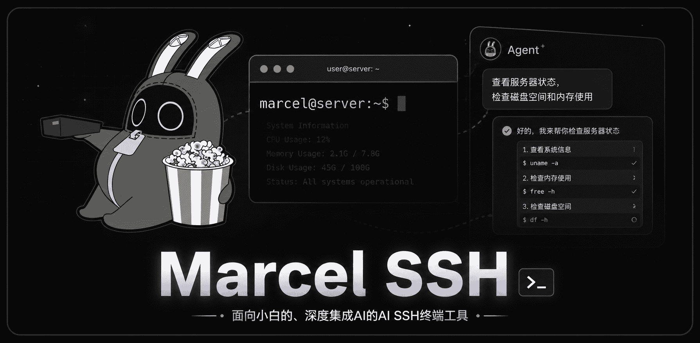
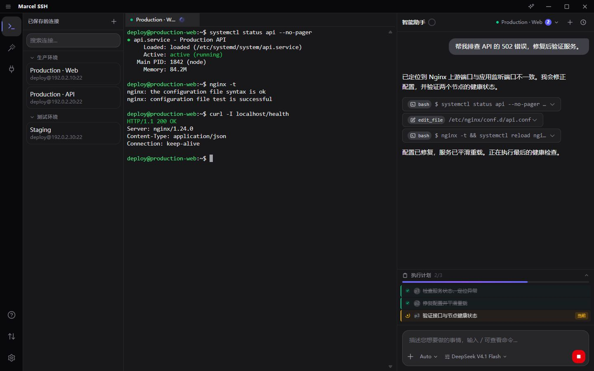

<p align="center">
  
</p>

<h1 align="center">Marcel SSH</h1>

<p align="center">
  <strong>服务器上的事，交给 Marcel。</strong>
</p>

<p align="center">
  <a href="https://github.com/q541810/Marcel_ssh/releases/latest">下载最新版本</a> ·
  <a href="docs">使用文档</a> ·
  <a href="https://github.com/q541810/Marcel_ssh/issues">反馈问题</a>
</p>

Marcel SSH 是一款开源的 **AI 原生 SSH 客户端**，支持 Windows 与 Android。

把终端、文件管理和 Agent 放在同一个工作空间。从排查故障到部署服务，说出目标，让 Agent 制定计划、调用工具、执行操作并验证结果。

你可以直接使用 Marcel 的内置 Agent，也可以通过 MCP Server，让自己熟悉的 Agent 使用 Marcel 的 SSH 与 SFTP 能力。**模型和提供商由你选择，连接与认证由 Marcel 在本机管理。**



_真实产品界面，使用脱敏示例数据。_

## 两种方式，接手服务器上的工作

### 直接使用 Marcel Agent

添加服务器连接，配置模型，然后描述你要完成的事情：

> “检查网站为什么出现 502，修复后验证服务。”
> 
> “在测试机上部署这个项目，配置 Nginx。”
> 
> “把旧机器上的服务迁移到新机器，并检查运行状态。”

Agent 可以执行命令、读写和编辑文件、通过 SFTP 上传下载，并用 Plan 跟踪任务进度。你可以查看每一步的工具调用，也可以随时接手终端。

### 在熟悉的工具里，顺手操作服务器

已经在使用 Claude Code、zcode、DeepSeek Harness 或其他支持 MCP 的工具？通过 Marcel，你可以继续在原来的工作流里，让 Agent 帮你查看服务器日志、上传文件、修改配置或验证部署。

在开发和处理业务的过程中，需要操作服务器时，Agent 可以直接调用 Marcel 提供的 SSH 与 SFTP 工具，复用你已保存的连接。无需反复配置连接参数，也无需把 SSH 密码或私钥写进提示词。

在 **设置 → 工具能力 → 让外部 Agent 接入 Marcel SSH** 中复制客户端配置，即可接入。

外部 MCP 调用不经过 Marcel 内置 Agent 的命令审批，调用控制由外部 Agent 负责。具体配置与使用边界见 [MCP Server 文档](docs/mcp-server.md)。

## 为什么选择 Marcel

### 模型与成本，由你选择

支持自定义模型提供商，按任务需要选择模型、API 或订阅。

内置文件读写、编辑与 SFTP 工具，让 Agent 直接完成操作，减少反复拼接命令、处理文件和摸索连接方式带来的试错。你也可以沿用已有的第三方订阅，让工具配合自己的使用习惯与预算。

Marcel SSH 免费开源，模型调用费用按你选择的提供商计费。

### 长任务，也能一步步推进

复杂任务需要持续跟踪目标与进度。

Marcel 通过 Plan 拆解任务、记录执行状态，配合上下文压缩及上下文搜索 tool 等手段，整理和查找历史信息，让 Agent 保留关键线索，继续完成后续工作。排查、修改、验证，都能沿着计划推进。

### 多台机器，一个任务

在你指定的机器范围内，让 Agent 跨连接处理业务修复、环境检查与服务迁移。

连接和工具调用由 Marcel 管理，你可以在同一个任务中查看进展，减少在多台服务器之间来回复制命令与结果。

_多机操控目前支持桌面端。_

### 审批方式，适应你的工作节奏

通过白名单、黑名单与 Auto 模式，选择适合当前任务的执行方式。

还可以按需开启独立的模型审批，支持 **LLM 与 Jev**，对操作增加一层判断。需要人工确认时，在界面中查看命令与相关说明，再决定是否执行。

### 让工具长成你需要的样子

插件系统可以扩展 Agent 的工具，也可以扩展你的工作空间：

- **扩展 Agent 能力**：接入自定义工具与工作流。
- **定制工作台**：添加侧边面板、小组件、桌宠或独立窗口。
- **通过市场管理插件**：在应用内发现插件，一键下载安装与更新。

你可以使用已有扩展，也可以开发自己的插件。

[插件开发指南](docs/plugin-development.md) · [插件 API 参考](docs/plugin-api.md) · [提交插件到市场](https://github.com/q541810/marcel-ssh-plugins)

## 生于 Agent，不止于 Agent

不使用 AI 时，Marcel 仍然是一款完整的 SSH 客户端。

- **SSH 终端**：多连接管理，支持符合 Windows 使用习惯的复制粘贴与点击定位光标。
- **SFTP 文件管理**：拖拽上传下载、文件夹上传、批量操作、远程编辑与在线解压。
- **Skills**：按需加载任务相关指引，定制 Agent 的工作方式。
- **MCP 扩展**：连接外部 MCP Server，为内置 Agent 增加工具能力。

终端、文件与 Agent 可以一起使用，你也可以只使用自己需要的部分。

## 凭据加密保存，连接由本机处理

让 Agent 操作服务器，无需把 SSH 密码或私钥交进提示词。Marcel 在本机管理认证，并为保存的凭据提供加密保护。

- **导入的 SSH 私钥使用 AES-256-GCM 加密保存**：应用目录中保存的是密文；用于加密的主密钥由系统凭据存储保管。
- **SSH 密码与模型 API Key 使用系统级凭据保护**：Windows 使用系统凭据存储，Android 使用 Android Keystore 加密保存，不以明文写入普通配置文件。
- **保留私钥自身的密码保护**：带 passphrase 的私钥导入后保留原有加密形态，Marcel 的存储加密再提供一层保护。
- **认证在本机完成**：连接时由 Rust 后端读取和解密所需私钥，敏感数据在不再需要时进行内存清理。

Agent 处理任务时，命令、文件内容和工具输出仍可能发送给你选择的模型提供商。

## Windows 与 Android

两端都支持 SSH 终端、Agent、SFTP 文件管理与 Skills。

| 能力                                  | Windows | Android                       |
| ----------------------------------- |:-------:|:-----------------------------:|
| SSH 终端与连接管理                         | ✓       | ✓                             |
| Agent 与执行计划                         | ✓       | ✓                             |
| SFTP 文件管理                           | ✓       | ✓                             |
| Skills                              | ✓       | ✓ |
| 插件系统                                | ✓       | —                             |
| 接入外部MCP和启动本地MCP Server              | ✓       | —                             |
| 多机操控                                | ✓       | —                             |
| 暴露给模型的本机子agent、upload、download等tool | ✓       | —                             |

此图可能拥有时效性问题，切勿当成准确的信息来源

### 手机上的任务，也值得认真对待

Android 端通过前台服务维持后台连接与任务运行，并提供适合触屏操作的终端辅助键栏。

任务通知会区分前后台：正在应用内查看时减少打扰；切到后台后，通过原生通知提醒需要审批、需要回答的问题，以及任务完成或失败。

不是桌面版的生搬硬套，而是单独为手机场景精选的一套工具配比

目前提供 Windows 与 Android 安装包。其他平台尚未正式支持，也暂无明确适配时间表。

## 快速开始

1. 前往 [最新发布页](https://github.com/q541810/Marcel_ssh/releases/latest)，下载 Windows 安装包或 Android APK。
2. 安装并打开 Marcel SSH，完成首次使用引导。
3. 添加 SSH 连接，配置认证方式。
4. 如果需要使用 Agent，添加模型提供商与模型。
5. 连接服务器，打开终端，或直接向 Agent 描述任务。

已有外部 Agent 的用户，也可以按照 [MCP Server 文档](docs/mcp-server.md)接入 Marcel。

## 交流与反馈

**QQ 交流群：1101255501**

欢迎分享使用经验、讨论功能，或者告诉我们哪些地方还不顺手。

遇到问题时，可以在QQ交流群中提供复现步骤、运行环境与相关日志。提交前请移除密码、密钥等敏感信息。

## 开发与贡献

参与贡献前，请先阅读 [贡献者说明](Contributors_read.md)。

想体验尚未发布的内容，可以拉取仓库，在准备好项目开发环境后运行 `dev.cmd`。后续通过 `git pull` 获取更新。

### 自行编译 Android

需要 Android SDK、NDK 27 与 JDK。在项目目录执行：

```powershell
$env:ANDROID_HOME="$env:LOCALAPPDATA\Android\Sdk"
$env:NDK_HOME="$env:LOCALAPPDATA\Android\Sdk\ndk\27.0.12077973"

pnpm tauri android build --apk --target aarch64
```

产物位于：

```text
src-tauri/gen/android/app/build/outputs/apk/universal/release/
```

正式签名需要自行配置仓库外的 keystore 与 `key.properties`。未配置时生成未签名 APK，可自行签名用于测试。

### 开发插件

- [插件开发指南](docs/plugin-development.md)：从零开始创建插件。
- [插件 API 参考](docs/plugin-api.md)：查看接口、字段与协议。
- [插件市场仓库](https://github.com/q541810/marcel-ssh-plugins)：提交和分发你的插件。

## 开源许可

Marcel SSH 使用 [GNU General Public License v3.0](LICENSE) 许可证。

## 致谢

感谢 [heibaiya-dev](https://github.com/heibaiya-dev) 对项目的贡献。

感谢 wisdom-ssh 为本项目带来的灵感。
